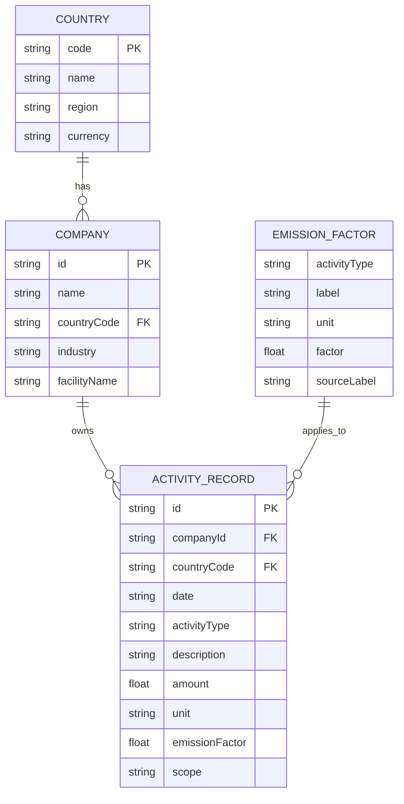

# HanaLoop Carbon Dashboard

## 1. 프로젝트 소개
HanaLoop Carbon Dashboard는 과제용 엑셀 데이터를 기반으로 탄소 배출량(PCF)을 시각화하는 대시보드입니다.

이 프로젝트는 활동 데이터와 배출계수를 바탕으로 배출량을 계산하고, Scope 기준으로 배출량을 집계하고 분석할 수 있도록 구성했습니다.

배출량 계산의 기본 원칙은 다음과 같습니다.

`배출량(kgCO₂e) = 활동량 × 배출계수`

현재 구현은 과제 데이터셋 기준으로 단일 기업 `HanaLoop CT-045`, 단일 국가 `대한민국`을 대상으로 동작합니다.

## 2. 주요 기능
- 월별 탄소 배출량 차트
- Scope별 배출 비중 시각화
- 활동 유형별 배출량 분석
- 활동 데이터 입력 및 validation
- KPI 카드 기반 요약 정보
- 과제용 데이터 기반 seed data 사용
- 활동 데이터 저장 후 실시간 UI 갱신

현재 미구현 기능은 본문에 완료 기능처럼 적지 않았으며, 필요한 항목은 모두 `향후 개선`으로 분리했습니다.

## 3. 기술 스택
- Next.js 16 (App Router)
- TypeScript
- React 19
- Zustand
- Recharts
- Tailwind CSS 4
- ESLint

## 4. 탄소 계산 방식
배출량은 아래 공식으로 계산합니다.

`배출량(kgCO₂e) = 활동량 × 배출계수`

예시:
- 전력 사용량 `kWh` × 전력 배출계수
- 원소재 사용량 `kg` × 원소재 배출계수
- 운송량 `ton-km` × 운송 배출계수

계산 결과는 `kgCO₂e` 기준으로 표시하며, 화면에서는 소수점 둘째 자리까지 반올림합니다.

## 5. 엑셀 데이터 매핑
프로젝트 루트의 `2026년_개발자_채용과제.xlsx` 파일에서 `과제용 데이터` 시트를 읽어 seed data로 반영했습니다.

매핑 기준:
- `일자` → `date`
- `활동 유형` → `activityType`
- `설명` → `description`
- `량` → `amount`
- `단위` → `unit`
- `배출계수` → `emissionFactor`

Scope 매핑:
- `전기` → `Scope 2`
- `원소재` → `Scope 3`
- `운송` → `Scope 3`

## 6. 데이터 구조 설명
### `ActivityRecord`
활동 데이터 1건을 표현합니다.

- `id`
- `companyId`
- `countryCode`
- `date`
- `activityType`
- `description`
- `amount`
- `unit`
- `emissionFactor`
- `scope`

### `EmissionFactor`
활동 유형별 배출계수 정보를 표현합니다.

- `activityType`
- `label`
- `unit`
- `factor`
- `sourceLabel`

### `Company`
대상 기업 정보를 표현합니다.

- `id`
- `name`
- `countryCode`
- `industry`
- `facilityName`

### `Country`
국가 정보를 표현합니다.

- `code`
- `name`
- `region`
- `currency`

### `Scope`
배출 범위를 표현합니다.

- `Scope 1`: 기업이 직접 배출한 온실가스
- `Scope 2`: 구매한 전력 사용으로 발생한 간접 배출
- `Scope 3`: 원소재, 운송 등 공급망에서 발생한 기타 간접 배출

## 7. ERD / 데이터 구조 다이어그램

관계 요약:
- `Country 1:N Company`
- `Company 1:N ActivityRecord`
- `EmissionFactor 1:N ActivityRecord`

## 8. 설계 의도
- 활동 데이터와 배출계수를 분리했습니다.
  배출계수가 바뀌더라도 활동 데이터 구조를 유지할 수 있고, 향후 배출계수 버전 관리와 외부 연동으로 확장하기 쉽기 때문입니다.
- Scope 기반 집계를 별도로 뒀습니다.
  경영자와 실무자가 직접 배출, 전력 간접 배출, 공급망 배출을 구분해서 볼 수 있어야 대시보드 해석이 쉬워지기 때문입니다.
- seed data 기반으로 구현했습니다.
  백엔드 구축보다 과제 핵심인 계산 로직, 시각화, 입력 UX 검증에 집중하기 위해서입니다.

## 9. Trade-off
- PostgreSQL 대신 seed data를 사용해 구현 속도와 제출 안정성을 우선했습니다.
  다만 실제 운영 환경에서는 DB 연동과 배출계수 버전 관리가 필요합니다.

## 10. 실행 방법
5단계 이내로 실행할 수 있습니다.

1. `npm install` 또는 `yarn`
2. `npm run build` 또는 `yarn build`
3. `npm start` 또는 `yarn start`
4. 브라우저에서 `http://localhost:3000` 접속

개발 모드가 필요하면 `npm run dev`를 사용할 수 있습니다.

## 11. AI 사용 내역
이번 과제 구현 과정에서 AI를 아래 범위에서 보조적으로 활용했습니다.

- 데이터 구조 설계 보조
- Zustand 오류 원인 분석 보조
- 엑셀 데이터 매핑 보조
- README 초안 작성 보조

최종 코드는 직접 검토 및 수정했으며, 실제 구현 범위를 벗어나는 내용은 제외했습니다.

## 12. 향후 개선
- PostgreSQL 연동
- CSV/XLSX 직접 import
- 배출계수 버전 관리
- 기업별 인증/권한 관리
- 관리자 검수 workflow
